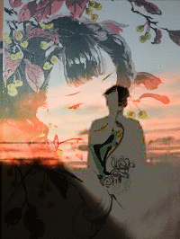
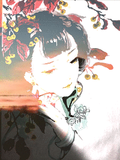
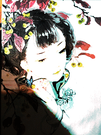
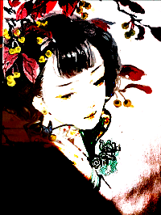
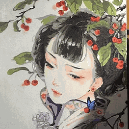
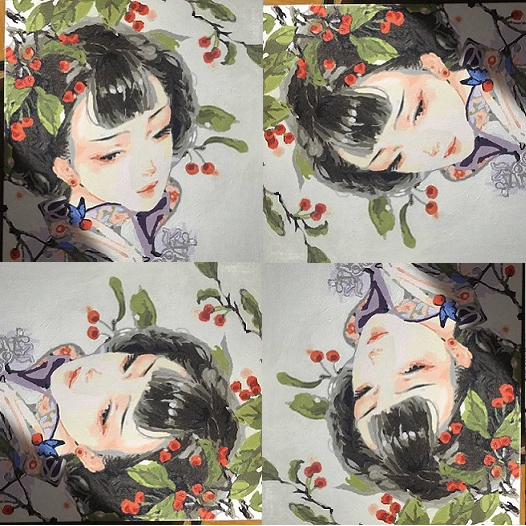

# Image-Processing

#### 介绍

图像处理 Image-Processing

使用 python 的 PIL 库，根据图像 rgba 原理实现了 滤镜，图像混合，图像裁剪，图像旋转，生成动图等功能

#### 软件架构

语言使用 python3.6，库用了 PIL math

#### 安装教程

python3.6
安装库 PIL math

#### 使用说明

1. 滤镜
   代码目录 source/filter.py
   实现了 灰度（gray），毛玻璃，马赛克，漫画风，反向，黑白，怀旧风，浮雕，素描，彩描，重影等滤镜

2. 图像混合
   代码目录 source/Image_overlap_fusion.py
   根据图层混合模式公式实现了 变暗，变亮，正片叠底，滤色，颜色加深，颜色减淡，线性加深，线性减淡，叠加，强光，柔光，亮光，点光，线性光，实色混合，排除，差值，相加，减去等图像混合模式

3. 图像构图
   代码目录 source/rotate.py
   实现了 旋转 裁剪 拼接 等功能

4. 根据已有图片生成动图
   代码目录 source/dynamic.py ，执行代码前检查originalImg/dynamic/目录下的图片，图片命名规范 数字.png

5. 图片效果展示
   滤镜效果图在 img-show/filter/ 目录下
   图像混合效果图在 img-show/Image-overlap-fusion/ 目录下
   图像构图效果图在 img-show/rotate/ 目录下
   生成动图效果图在 img-show/dynamic/ 目录下

#### 参与贡献

1. Fork 本仓库
2. 新建 Feat_xxx 分支
3. 提交代码
4. 新建 Pull Request

#### 快速查看效果图

19种图片叠加效果使用 dynamic.py 代码生成动图展示如下：

11种图片滤镜效果使用 dynamic.py 代码生成动图展示如下：

图片旋转效果动图展示如下：

图片拼接展示效果如下：

图片裁剪展示效果如下：

